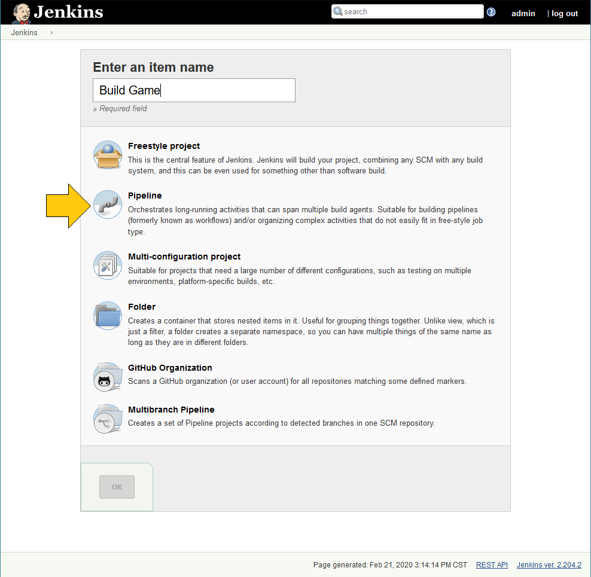
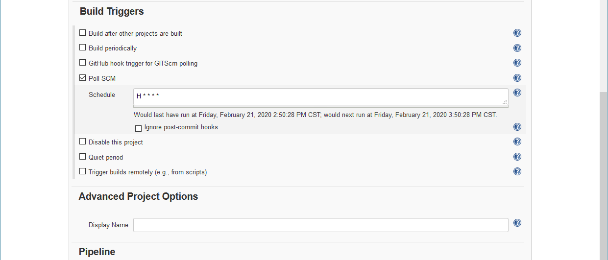
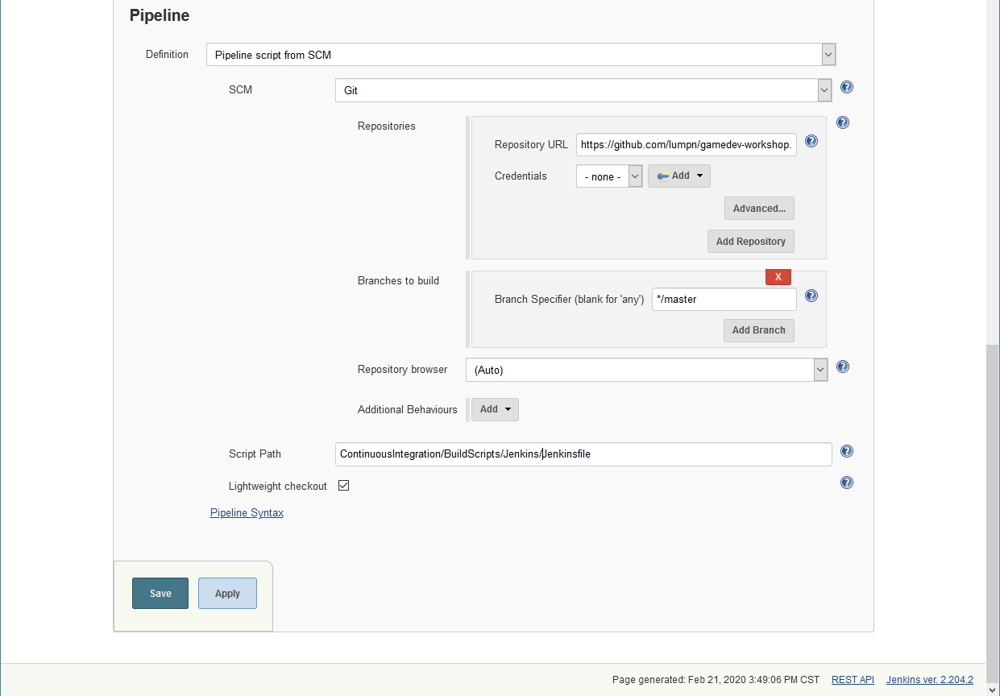

# 持續整合（Continuous Integration）
不斷做測試、穩定推版本、及早除臭蟲。

## 問題
遊戲通常由橫跨多種專業並相互倚賴的素材所構成，專案很容易因為成員在沒有意識到關聯影響的情況下，就被改爛掉。某個問題如果需要越長的時間才浮現出來，通常也需要越長的時間才能找出到底是哪次修改改爛的。

不僅如此，通常在任一時間點，團隊內每個人電腦上的專案狀態都存在細微的差異，要用其他機器來重現問題時難度更上升。有些疑難雜症甚至只出現在目標平台上。

```
¯\_(ツ)_/¯
「我電腦上可以跑（攤手）」
```

## 解決方案
我們希望盡可能地降低從某次修改內容，到該次修改結果在目標平台上可以被呈現出來的時間差。我們想要能有某種檢查機制，來告訴我們有東西壞掉了，而且這個檢查機制應該每次修改後都要執行。這代表，必須把整個流程全部自動化。

持續整合與發佈將透過以下步驟來達成：
1. 維護單一的專案儲存庫（repository）
2. 把建置流程自動化
3. 把測試流程自動化
4. 把發佈流程自動化

## 維護單一的專案儲存庫
如果你已經在使用 [版本控制系統](https://en.wikipedia.org/wiki/Version_control) ，這段基本上可以跳過。繼續使用你已經順手的版控軟體即可。如果你還沒有用過版控，目前最好的選擇是 [GitHub 企業版](https://github.com/enterprise) 與 [Plastic SCM](https://www.plasticscm.com/) 。[兩者都要](https://github.com/pricing) [花錢](https://www.plasticscm.com/pricing) ，但不會太貴，絕對值回票價。對 [Unity Collaborate](https://unity.com/unity/features/collaborate) 敬而遠之，因為功能有限，而且用起來還跟預期的不太一樣。目前狀態下它大概在 game jam 時有點用，不過差不多也就這樣了。

## 建置流程自動化
如果你用的是 GitHub 企業版，可以看一看 [GitHub Actions](https://github.com/features/actions) 的用法。不要用 [Unity Cloud Build](https://unity3d.com/unity/features/cloud-build) 比較好，它的功能對於實戰需求來說還有點太基礎了。我們會使用 [Jenkins](https://jenkins.io/) 來做後續介紹，它能本地執行、開源，而且還免費。

### Jenkins
我們會把 Jenkins 連接到專案儲存庫，並在*每次*修改 commit 之後都叫它幫我們建置專案一次。當然這樣長久下來數量會很龐大，所以最好是將 [Jenkins 安裝](https://jenkins.io/download/thank-you-downloading-windows-installer-stable/) 在空機器上，這台機器也將會是我們的建置專用伺服器（build server）。

安裝好 Jenkins 之後，使用初始的 admin 密碼到 http://localhost:8080 登入伺服器，Jenkins 這時會問你要安裝哪些外掛模組，這邊我們先選預設建議就好（Install suggested plugins）。我們只會用到一小部分的外掛，但要一個一個手動挑蠻麻煩的。說到外掛，其實 Jenkins 裡的所有東西都是一種外掛，大部分是其他人自願貢獻的內容。實際上它們大部分都沒有到*商業上線專案可用（production ready）*的品質，這也是為何常看到當中有各種重複功能的外掛，但卻都無法完全滿足我們需求的原因。

### 建置工作（Build job）
為了讓 Jenkins 建置我們的遊戲專案，需要將所有相關步驟包在一個 Jenkins job 裡面。這邊我們先只用 Pipeline 樣版，跳過所有的外掛，讓事情盡量單純一點。







這邊 Jenkins job 要做的設定很少，只需要它去我們的專案儲存庫裡下載 [pipeline 指令碼](https://jenkins.io/doc/book/pipeline/jenkinsfile/) 檔案，並執行它就好了。下方指令碼中會有所有相關細節描述。

在 [我們的 pipeline 指令碼](BuildScripts/Jenkins/Jenkinsfile) 中，我們會：
1. 更新到專案儲存庫裡面的最新版本
2. 啟動 Unity 並讓它去載入元件
3. 執行單元測試
4. 建置專案
5. 最後，把建置完成的版本上傳

```groovy
  environment {
    GIT = '"C:\\Program Files\\Git\\bin\\git.exe"'
    UNITY = '"C:\\Program Files\\Unity\\Hub\\Editor\\2018.4.14f1\\Editor\\Unity.exe"'
    PROJECT = 'ContinuousIntegration'
    PLATFORM = 'Win64'
    OUTPUT = 'Build/ContinuousIntegration.exe'
    STEAMCMD = '"W:\\Jenkins\\steamworks\\tools\\ContentBuilder\\builder\\steamcmd.exe"'
    STEAMUSERNAME = 'steam_username_here'
    STEAMPASSWORD = 'steam_password_here'
    STEAMSCRIPT = '"ContinuousIntegration\\BuildScripts\\Steam\\app_build.vdf"'
  }
  stage('Import Assets') {
    steps {
      bat "$UNITY -batchmode -logFile - -projectPath $PROJECT -buildTarget $PLATFORM -quit -accept-apiupdate"
    }
  }
  stage('Run Unit Tests') {
    steps {
      bat "$UNITY -batchmode -logFile - -projectPath $PROJECT -buildTarget $PLATFORM -runEditorTests"
    }
  }
  stage('Build') {
    steps {
      bat "$UNITY -batchmode -logFile - -projectPath $PROJECT -buildTarget $PLATFORM -quit -buildWindows64Player $OUTPUT"
    }
  }
```

## 測試流程自動化
既然我們已經在每次建置專案前加入單元測試，那最好就讓單元測試盡可能涵蓋各種潛在的問題。先從最基礎的檢查一致性開始。

```csharp
        [Test]
        public void ShaderHasErrors()
        {
            var infos = ShaderUtil.GetAllShaderInfo();
            foreach (var info in infos)
            {
                Assert.IsFalse(info.hasErrors, "Shader '{0}' has errors.", info.name);
            }
        }
```

要完善一整套測試系統需要投入很多時間。原則上來說，每次專案上出現沒碰過的問題時，大概就是新增一項測試的好時機。撰寫這項新測試的角度，當然就是希望可以防止同一個問題再次發生。

## 發佈流程自動化
現在這個建置版本已經通過了我們所設下的一些基礎檢查，但至此尚欠最關鍵的一步。我們需要*真人*來進行測試。

```
「沒有真的發佈的東西，等於不存在。」── Jonas Bötel
```

所幸，[上傳版本到 Steam](https://partner.steamgames.com/doc/sdk/uploading) 的流程還算直觀，而且也有足夠的文件可以查。

```groovy
    stage('Upload Build') {
      steps {
        echo "$STEAMCMD +login $STEAMUSERNAME $STEAMPASSWORD +run_app_build $STEAMSCRIPT"
      }
    }
```

Steam 的政策是在他們的伺服器上*永久*保留任何上傳過的版本，這在發生預期外問題並需要緊急回復舊版的時候非常有用。但話說回頭，我們也不希望冒著玩家每天都有機會玩到爛掉版本的風險。所以切記，這邊自動上傳的版本必須指定到 Steam 上的 *Beta* 分支上，可以透過 `app_build.vdf` 檔案裡的 `setlive` 屬性來進行設定。這樣一來，玩家就可以選擇他們是否真的心臟夠大顆，來試玩最新、~~熱到燙舌頭~~的版本。每隔幾週，當版本確定夠穩定之後，我們可以再透過 Steam 後台去發佈到公開分支去。

## 延伸閱讀
- [Continuous Integration](https://martinfowler.com/articles/continuousIntegration.html) by Martin Fowler
- [Continuous integration and automated testing](http://itmattersgames.com/2019/02/18/continuous-integration-and-automated-testing/) by Michele Krüger
- [Unite 2015 - Continuous Integration with Unity](https://www.youtube.com/watch?v=kSXomLkMR68) by Jonathan Peppers
- [Setting Up a Build Server for Unity with Jenkins](https://www.youtube.com/watch?v=4J3SmhGxO1Y) by William Chyr

## 翻譯
如果你覺得這個工作坊有其價值，並通曉另一個語言，我們非常歡迎任何幫助工作坊內容進行翻譯的協助。把本儲存庫內容 clone 下來後，增加一份特定語言在地化的 README.md，例如 README-pt-BR.md，並送 PR 給我們。
